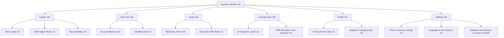

# Quantum Wealth Manager (Fiduciary Dashboard Console)

Quantum Wealth Manager is a premium, high-performance financial management application built on **Angular 19**, **Tailwind CSS variables**, and **TypeScript signals**. It is designed with enterprise-grade glassmorphism aesthetics, responsive equal-column splits, and supports dynamic appearance configurations, multilingual translations, and cross-platform native packaging (Android & iOS).

---

## 🌌 Visual Design & Spacing Architecture

The user interface follows a modern glassmorphism design system utilizing frosted panels, soft glowing radial mesh backdrops, and sharp data grids.

### 🎨 Theme Customization Engine
The dashboard supports four preconfigured appearance themes, hot-swappable in real time:
- **Cyberpunk Slate (Default)**: Deep midnight slate canvas (`#020617`) with glowing neon cyan (`#22d3ee`) borders and interactive accents.
- **Fiduciary Emerald**: Forest green canvas (`#021f15`) with sharp emerald green (`#10b981`) text and buttons.
- **Aurora Purple**: Midnight purple canvas (`#08031a`) with vibrant fuchsia (`#d946ef`) and indigo gradients.
- **Nordic Light**: Clean light mode slate canvas (`#f8fafc`) with deep charcoal text (`#0f172a`) and corporate blue accents.

### 📐 Spacing Density Modes
- **Cozy Mode**: Font size `14px`, card paddings `24px`, container gap `24px` — optimized for large monitors and desktop presentation.
- **Compact Mode**: Font size `12px`, card paddings `16px`, container gap `16px` — reduces spacing to fit up to 35% more transaction records and charts on phone viewports.

---

## 🧭 Navigation & Visual Column Layout Maps

The dashboard is structured into six navigation tabs. Each tab divides its components into equal visual splits on desktop displays:



### 1. Ledger Tab (3-Column Equal Split)
- **Daily Ledger (Left - 33%)**: List of parsed, synchronized wealth transactions.
- **SMS Parser (Center - 33%)**: Submits banking alert text blobs to auto-extract transaction parameters.
- **Record Builder (Right - 33%)**: Core transaction manual insertion form.

### 2. Cash Flow & Accounts Tab (2-Column Equal Split)
- **Account Balances (Left - 50%)**: Real-time accounts list filtered by category (Savings, Cards, Investment, Cash).
- **Cash Flow Audit (Right - 50%)**: Inflows vs. Outflows comparison showing monthly compound savings index values.

### 3. Goals & Milestones Tab (2-Column Equal Split)
- **Milestones Solver (Left - 50%)**: Financial tracker calculating future costs adjusted for a 6% annual inflation.
- **Goal Form & SIP Matrix (Right - 50%)**: Form to add goals alongside the Step-up SIP Asset Allocation Matrix.

### 4. AI Diagnostics Tab (2-Column Equal Split)
- **AI Fiduciary Report (Left - 50%)**: Detailed prompt evaluations regarding budget leakages and investment solvency.
- **FIRE Simulator & Tax Optimizer (Right - 50%)**: Interactive Compose-style retirement graphs stacked on top of the Old vs. New Tax slabs checker.

### 5. Preferences Tab (2-Column Equal Split)
- **User Profile Summary (Left - 50%)**: Displays Name, Age, Monthly Inflow, and Membership status, with edit drawer controls directly below.
- **Budgets & Categorization (Right - 50%)**: Interactive monthly categories budget progress charts stacked on top of custom regex categorization rules.

### 6. Settings Tab (2-Column Equal Split + Full-Width Admin Section)
- **Appearance & Density (Left - 50%)**: Hot-swappable visual preferences controls.
- **Language & Credentials (Right - 50%)**: Select language options, manage tokens, or trigger Account Sign Outs.
- **Database Administrator Dashboard (Bottom - 100%)**: Interactive table browser allowing admins to examine active SQL datasets, trigger seeds, or delete records.

---

## 🛠️ Build and Local Development

### Prerequisites:
- **Node.js**: v20 or higher.
- **NPM**: v9 or higher.

### Steps to Run:
1. Clone the project and navigate into the root directory.
2. Install npm packages:
   ```bash
   npm install
   ```
3. Set your custom environment variables in a `.env.local` file:
   ```env
   GEMINI_API_KEY="your-gemini-api-key-here"
   ```
4. Start the local server:
   ```bash
   npm run dev
   ```
5. Open your browser and navigate to **[http://localhost:3000/](http://localhost:3000/)** to interact with the dashboard.

---

## 📱 Mobile Wrapper Packaging (Android & iOS)

This repository includes a preconfigured **CapacitorJS** setup, allowing you to compile the web application for native mobile devices:

### Packaging Steps:
1. Compile the static Angular web assets:
   ```bash
   npm run build
   ```
2. Copy the browser assets into Android and iOS configurations:
   ```bash
   npx cap sync
   ```
3. Run the projects in native developer IDEs:
   - For Android: `npx cap open android` (requires **Android Studio**).
   - For iOS: `npx cap open ios` (requires **Xcode** on macOS).

---

## 💾 Administrative Database Management

The **Database Administration Console** located at the bottom of the Settings Tab provides direct graphical control over local data.

### Graphical Management Interface
- **Seed DB**: Click to populate the local database file (`quantum_wealth_db.json`) with representative sample transactions.
- **Truncate DB**: Instantly wipes user records to reset states.
- **Table Record Explorer**: Review transaction details and click target trash icons on each row to perform inline deletions.

### Accessing Direct Console Shell
Administrators can inspect or modify database files manually via SQLite:
```bash
# Open SQLite database shell console
sqlite3 quantum_wealth_db.json

-- SQL: Force-upgrade a user to Pro Tier
UPDATE subscriptions SET tier = 'Pro' WHERE user_id = 'target-user-uuid-here';
```
